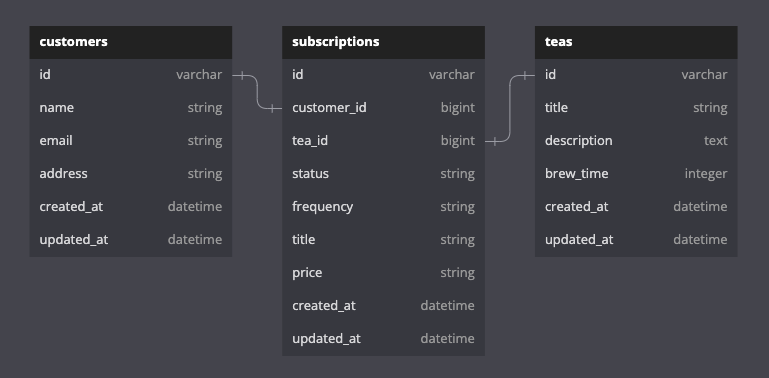

<!-- PROJECT LOGO -->
 

  <h2 align="center"><strong>Tea Box API</strong></h2>

  

    Module 4 Take Home 
    Turing School of Software and Design 
    Cohort: 2211 Back End
     
  

### Built With

 
 

Gems Used: Pry, simplecov, shoulda-matchers, jsonapi-serializer

<!-- ABOUT THE PROJECT -->
## About The Project

[Take-Home](https://mod4.turing.edu/projects/take_home/) is the final project for the Turing School's module 4 program. Throughout module 4, we have started to dive in to preparing for the interview process. This project allows students to plan for and exectue a take home exam.
  
Tea Box is an API that allows users to make tea subscriptions for customers. 

## Learning Goals

<ul>
  <li>Complete a take-home style exam in 8 hours</li> 
  <li>Learn how to manage time for a project of this scope</li>
  <li>Be able to explain your process and decisions</li>
</ul>

(<a href="#readme-top">back to top</a>)

<!-- GETTING STARTED -->
## Getting Started

* Before running these steps, make sure you have the correct versions of ruby and rails*

1. Fork and clone this repo
`git clone git@github.com:KaraJoHo/tea_box.git`
2. Run bundle install in your terminal
`bundle install`
3. Set up the database by running:
`rails db:{drop,create,migrate,seed}`
4. Run rails s to start the server
`rails s`
5. Open postman to test the endpoints 
If you don't have postman, go to https://www.postman.com to install it and read about use. You can access one endpoint from your browser after running the server by searching `http://localhost:3000//api/v1/customers/1/subscriptions`  
However, for the `post` and `patch` requests, you will need to use postman to test those endpoints.
  

### Configuration
* Ruby version 3.1.1
* Rails version 7.0.4

## Testing 

To run tests, type this in your terminal: 

 `bundle exec rspec` 

All tests should be passing

## Schema 

<!-- USAGE EXAMPLES -->
## Endpoint Requests and Responses

#### Here are some examples of requests and responses ran in Postman.
 

  
<strong>Endpoints</strong>

    
   

  
   Request: `GET /api/v1/customers/1/subscriptions`
    
   Response: 

   
    
   

   Request: `POST /api/v1/customers/1/subscriptions`
   Request Body: 
   
    
   Response:

   
    
   

   Request: `PATCH /api/v1/customers/1/subscriptions/2`
   Request Body: 
   
    
   Response:

   
    

 

(<a href="#readme-top">back to top</a>)

<!-- CONTACT -->
## Contact

Reach out anytime on [LinkedIn](https://www.linkedin.com/in/81012911-91208/)

(<a href="#readme-top">back to top</a>)
